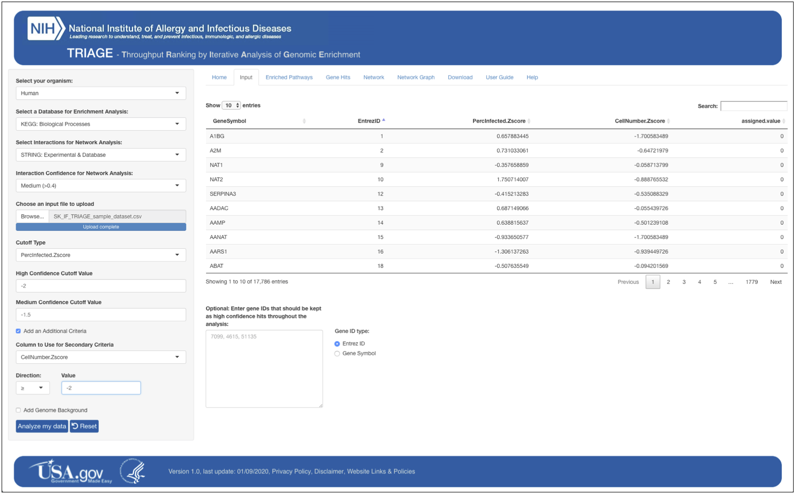
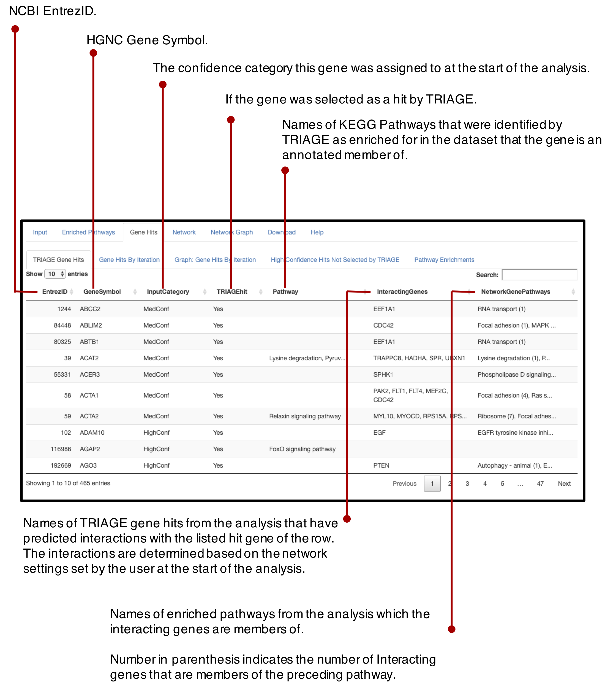
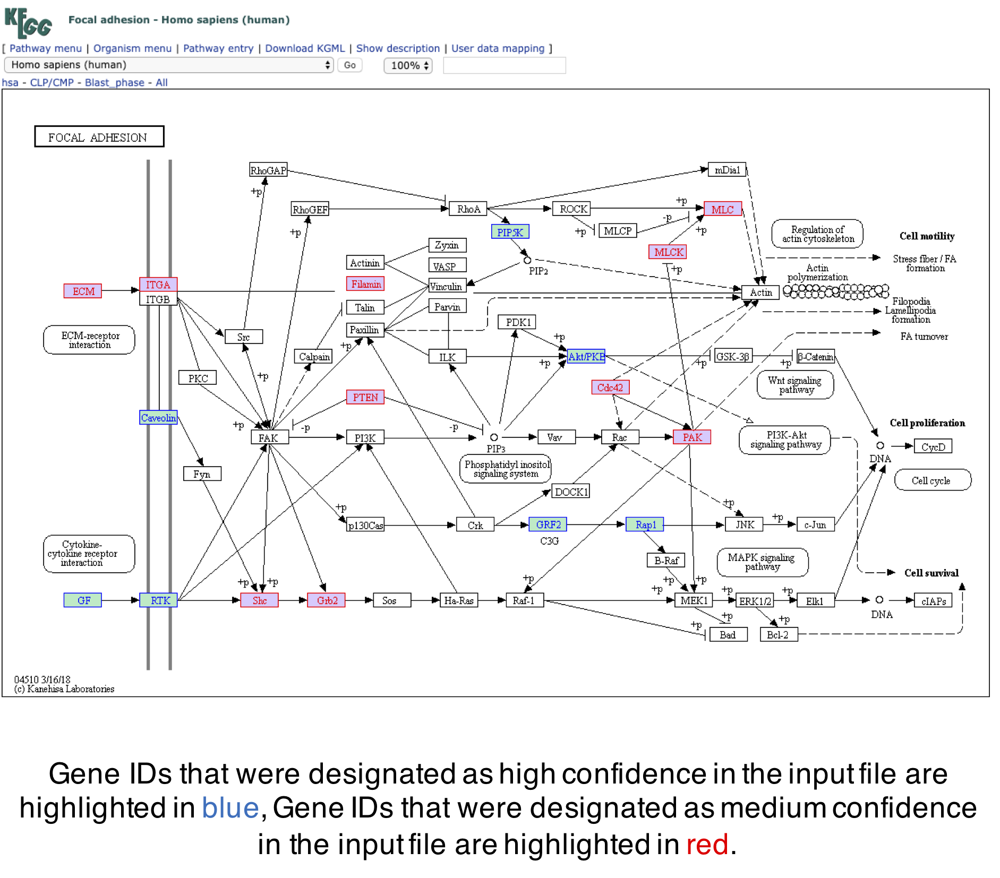
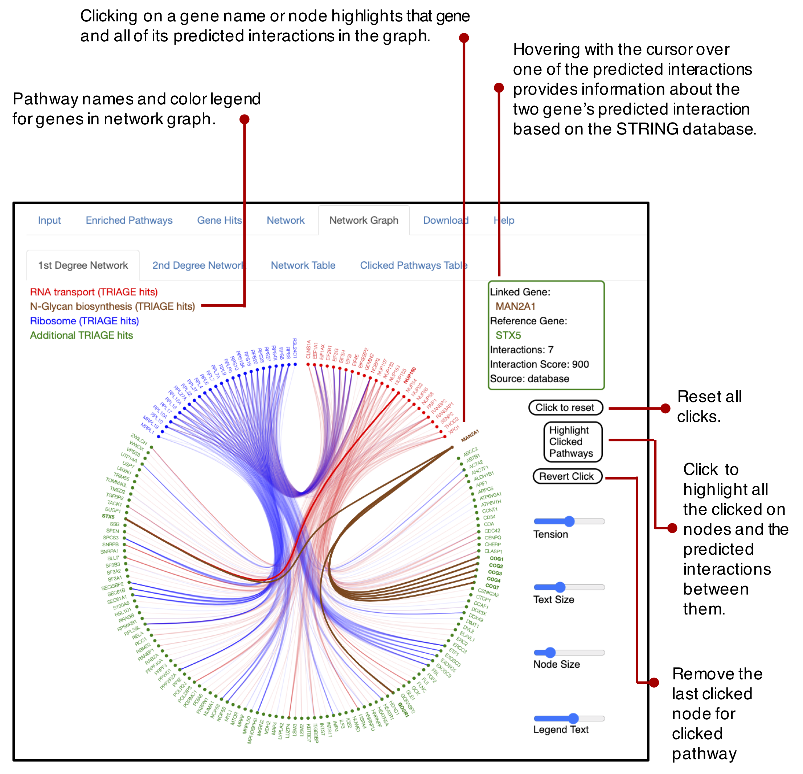

# TRIAGE
(**T**hroughput **R**anking by **I**terative **A**nalysis of **G**enomic **E**nrichment)


The Throughput Ranking by Iterative Analysis of Genomic Enrichment (TRIAGE) platform is designed to facilitate robust hit selection from high-throughput studies. 

TRIAGE integrates analysis from protein to protein predicted interactions and statistical enrichments of known gene sets to correct for the false positive and false negative error rates that are associated with normalization methods that require arbitrary cutoffs. By utilizing data sorted into low, medium, and high confidence tiers the TRIAGE platform integrates the experimental readout of the analyzed study with curated knowledge of biological networks and interactions. 

TRIAGE is best utilized as tool for selecting candidates from high-throughput studies to be further validated by rigorous low throughput follow up studies. The analysis outputs and platform features are designed to guide prediction, analysis, and hypothesis generation from large-scale datasets that can then be tested in targeted follow up assays.

TRIAGE is available as publicly facing website, as an R shiny app that can be run locally, and as a standalone R function.


## Getting Started

TRIAGE is available on the Internet through our [development site](https://triage.niaidawsqa.net) or/and [production site](https://triage.niaid.nih.gov/). TRIAGE can also be downloaded and run as a standalone application. The instructions below will get you a copy of TRIAGE up and running on your local machine. 

### Prerequisites

To run TRIAGE on your local machine, R and Rstudio should be installed and running on your machine. Instructions are available for [R installation](https://cran.r-project.org/bin/) and for [RStudio installation](https://www.rstudio.com/products/rstudio/download/). In addition, several R packages are also required for TRIAGE to work on your local machine. 

```
# To install required R packages from R commandline
library(shiny)
library(shinyjs)
library(shinyBS)
library(readr)
library(dplyr)
library(stringi)
library(DT)
library(data.table)
library(igraph)
library(edgebundleR)
library(shinyAce)
library(rJava)
library(networkD3)
library(visNetwork)
library(org.Hs.eg.db)
library(org.Mm.eg.db)
library(AnnotationDbi)
library(reshape2)
library(ggplot2)
library(tidyr)
library(gridExtra)
library(crosstalk)
library(htmltools)
library(stringr)
library(tools)
library(readxl)
Sys.setenv(R_ZIPCMD="/usr/bin/zip")
```

### Installing

Before installing TRIAGE, you need to install *git*, if not installed already, by following [these instructions](https://gist.github.com/derhuerst/1b15ff4652a867391f03). After installing *git*, you can install TRIAGE on your local machine in your home directory or anywhere under your home directory:

```
# For developmental version
$git clone https://github.niaid.nih.gov/Signaling-Systems-Unit/TRIAGE.git

# Or for production version
$git clone https://github.com/niaid/TRIAGE
```

After this, you should see a TRIAGE directory which contains all required files and data to run TRIAGE on your local machine.

## Running TRIAGE

To run TRIAGE on your local machine, start RStudio first, open 'app.R' file in RStudio from your TRIAGE directory, and then click 'Run App' button to start TRIAGE. You should see TRIAGE running in your default web browser.



### Running Tests

A sample input file (`LPS_sample_dataset.csv`) can be used to test TRIAGE. The sample file is a part of TRIAGE package and can be found in the TRIAGE directory:

```
# Sample input file
TRIAGE/app/www/SampleDatasets/LPS_sample_dataset.csv
```





### User Guide

A detailed user guide is available on website and in the TRIAGE directory:

```
# Detailed User Guide
TRIAGE/app/www/TRIAGE_userguide_V4.csv
```


### TRIAGE as an adaptable R function:

To make TRIAGE an adaptable framework for iterative analysis with different datasets and databases beyond the databases and settings used on this platform, a R script version of a standalone TRIAGE function can be downloaded. The TRIAGE function relies on calling two separate analysis function, a pathway enrichment function and a network analysis function. The master TRIAGE function applies the pathway and network function iteratively, and the results are tested for when the analysis converges on a single set.

The list of input variables that can be selectively assigned in the adaptable TRIAGE function in R and their required formats are:

screen.datafame: A data frame of the screen. 

ID.column: A column within the screen.dataframe for the identifiers of the targets (EntrezID, GeneSymbol, etc.).

criteria.column: A column within the screen.dataframe of the criteria for being considered a hit.

highconf.criteria: A criteria each target has to meet to be considered a "high confidence" hit.

midconf.criteria: A criteria each target has to meet to be considered a "mid confidence" hit.

criteria.setting: Whether the function should be using "equal", "greater than or equal", or "less than or equal" when assessing if confidence criteria is met. criteria.setting input should be in the format of "equal", "greater", or "less".

enrichment.dataframe: A data frame to be used for pathway membership in the format of a column of IDs (should be same as ID column in screen.dataframe in ID type and column title) and a column of which group they are part of. (each ID~group relationship needs to be in its own separate row).

enrichment.title: Name of the column with the names of the enrichment groups the targets are members of.

stat.test: Name of the statistical test to be used for measuring enrichment confidence. Needs to be in the format of either "pVal", "FDR", or "Bonferroni".

test.cutoff: A numeric value which a less than value in stat.test will be considered a significant enrichment.
network.igraph: an igraph of the network to be used for network analysis (network igraph must use the same ID type as screen.dataframe)

The user provided variables are then used to apply the iterative function as in the previous paragraph. The adaptable version of TRIAGE broadens the possibility for its application beyond the use of the specific databases and settings it was designed in. 

The TRIAGE function provides an output in the format of a R script list that contains three data frames: 
1.	The input data frame with an appended 'TRIAGE.hit' column. 
2.	A data frame of high confidence and medium confidence designation at each iteration of the analysis. 
3.	A data frame of final TRIAGE enrichments from the provided enrichment data frame.

The TRIAGE function can be downloaded from the app


```
# TRIAGE as standalon R function
TRIAGE/app/www/RscriptsDownload/TRIAGE_R_function.R
```


### R code for our manuscript:

The R code used to generate the analysis and figures for our [manuscript](https://www.biorxiv.org/content/10.1101/2020.07.15.204917v2) is included in the github page.

```
#  Manuscript R code
TRIAGE/manuscript/Rcode/
```

## Authors

**Sam Katz,**
**Jian Song,**
**Kyle Webb,**
**Nicolas Lounsbury,**
**Iain Fraser**
Contact us at triage-team@nih.gov


## Acknowledgments

* We appreciate all the help we got from NIH\NIAID\OCICB, particularly the OEB Platform Team.
* We also want to thank our [LSB colleagues](https://www.niaid.nih.gov/research/lab-systems-biology) at NIH/NIAID for their support.


